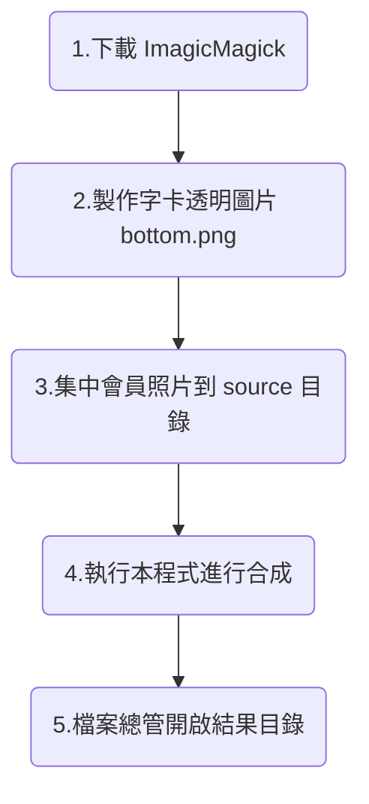

# 相片批次上字卡工具
這是一個用於自動將相片和底圖(字卡)合併的工具，適用於大量相片需要加入相同底圖的場景，例如本校斐陶斐會員典禮中，合影相片必須上字卡(紅布條)的作業，在過去必須用人工操作影像處理軟體合併相片與字卡，但相片眾多時極易發生遺漏或字卡位置錯誤的問題，因此規劃以 ImageMagick 這套開源專門處理影像的命令列工具，再配合批次檔解決自動化合成的問題。

## 流程


## 目錄配置
```
batchLowerThird/
├── run.cmd      # 批次處理程式
├── bottom.png   # 要合併的底圖(字卡)
├── ImageMagick7/ # ImageMagick 工具目錄
│   ├──convert.exe    # ImageMagick 的主要圖像處理工具
│   └──magick.exe     # ImageMagick 的其他輔助工具
├── source/      # 存放原始相片的目錄
└── output/      # 合併後圖片的輸出目錄
```
